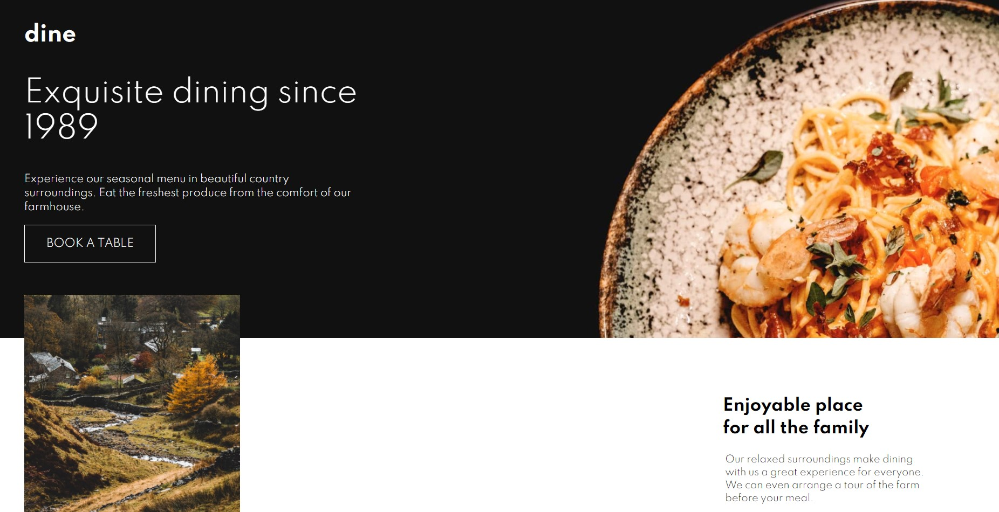

# Frontend Mentor - Dine Website Challenge solution

This is a solution to the [Dine Website Challenge challenge on Frontend Mentor](https://www.frontendmentor.io/challenges/dine-restaurant-website-yAt7Vvxt7). Frontend Mentor challenges help you improve your coding skills by building realistic projects. 

## Table of contents

- [Overview](#overview)
  - [The challenge](#the-challenge)
  - [Screenshot](#screenshot)
  - [Links](#links)
  - [Built with](#built-with)
  - [What I learned](#what-i-learned)
  - [Continued development](#continued-development)
  - [Author](#author)

## Overview

### The challenge

Users should be able to:

- View the optimal layout for each page depending on their device's screen size
- See hover states for all interactive elements throughout the site
- See the correct content for the Family Gatherings, Special Events, and Social Events section when the user clicks each tab
- Receive an error message when the booking form is submitted if:
  - The `Name` or `Email Address` fields are empty should show "This field is required"
  - The `Email Address` is not formatted correctly should show "Please use a valid email address"
  - Any of the `Pick a date` or `Pick a time` fields are empty should show "This field is incomplete"

### Screenshot




### Links

- Live Site URL: [View live page here](https://dine-restaurant-website-mauve.vercel.app/)

### Built with

- Semantic HTML5 markup
- CSS custom properties
- Sass preprocessor
- Flexbox
- Mobile-first workflow

### What I learned

I learned how to include images that change based on screen width using picture element,
then the source element in which there are two attributes, media: match the media queries in css
srcset: the image we want to display.

```html
        <picture>
            <source media="(min-width: 900px)" srcset="./images/homepage/family-gathering-desktop@2x.jpg">
            <source media="(min-width: 500px)" srcset="./images/homepage/family-gathering-tablet.jpg">
            
         </picture>
```
Also i noticed both pages share the same footer bottom, i wanted to see what can be done in html 
when there is repetitive code, maybe in this project there is no need to create a separate file,
but it can happen that more pages share same code, so by using an iframe tag it is possible create components.

```html
     <iframe src="footer-bottom.html" 
             onload="this.before((this.contentDocument.body||this.contentDocument).children[0]);this.remove()"
             title="footer-bottom"
      >
    </iframe>
```
Last but not least i got better at responsive web design by following mobile-first principle.

### Continued development

I did challenge myself with this project, either the design and functionality but i would like to speed up
the entire process in the near future, especially when it comes to decide how to go in the html since the 
beginning, based on what it needs to be accomplished in JS.

## Author

- Frontend Mentor - [@Da-vi-de](https://www.frontendmentor.io/profile/Da-vi-de)
